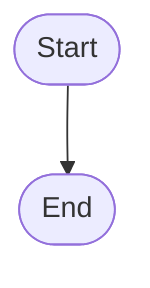
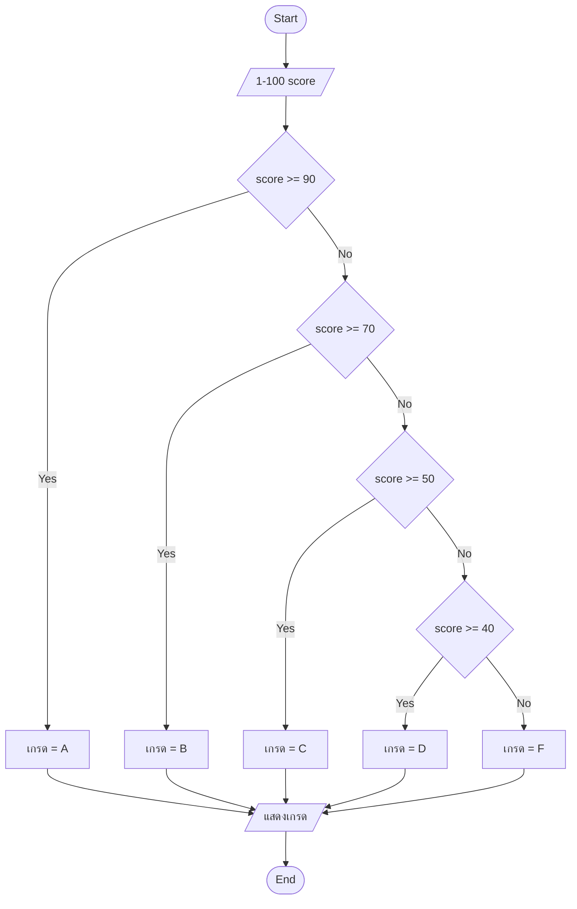
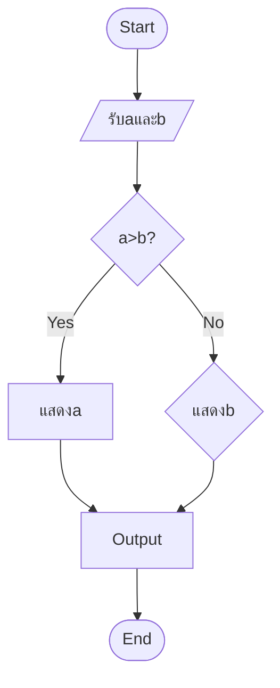
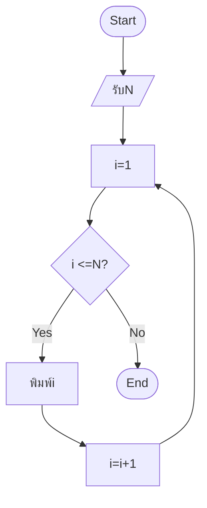

```mermaid
flowchart TD
A([Start]) --> B([End])
```

โจทย์ A — ตรวจสอบเกรด

```mermaid
flowchart TD
Start([Start]) --> Input[/1-100 score/]
Input --> D1{score >= 90}
D1 -->|Yes| A[เกรด = A]
D1 -->|No| D2{score >= 70}
D2 -->|Yes| B[เกรด = B]
D2 -->|No| D3{score >= 50}
D3 -->|Yes| C[เกรด = C]
D3 -->|No| D4{score >= 40}
D4 -->|Yes| D[เกรด = D]
D4 -->|No| F[เกรด = F]
A & B & C & D & F --> Output[/แสดงเกรด/]
Output --> End([End])
```

โจทย์ B — หาค่าสูงสุดจาก 2 ตัวเลข

```mermaid
flowchart TD
Start([Start]) --> Input[/รับaและb/]
Input --> D1{a>b?}
D1 -->|Yes| A[แสดงa]
D1 -->|No| B{แสดงb}
A & B --> Output
Output --> End([End])
```

```mermaid
flowchart TD
Start([Start]) --> Input[/รับN/]
Input --> A[i=1]
A --> B{i <=N?}
B -->|Yes| C[พิมพ์i]
B -->|No| D([End])
C -->E[i=i+1]
E -->A
```
