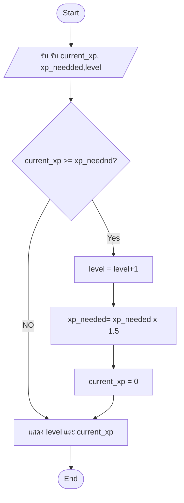
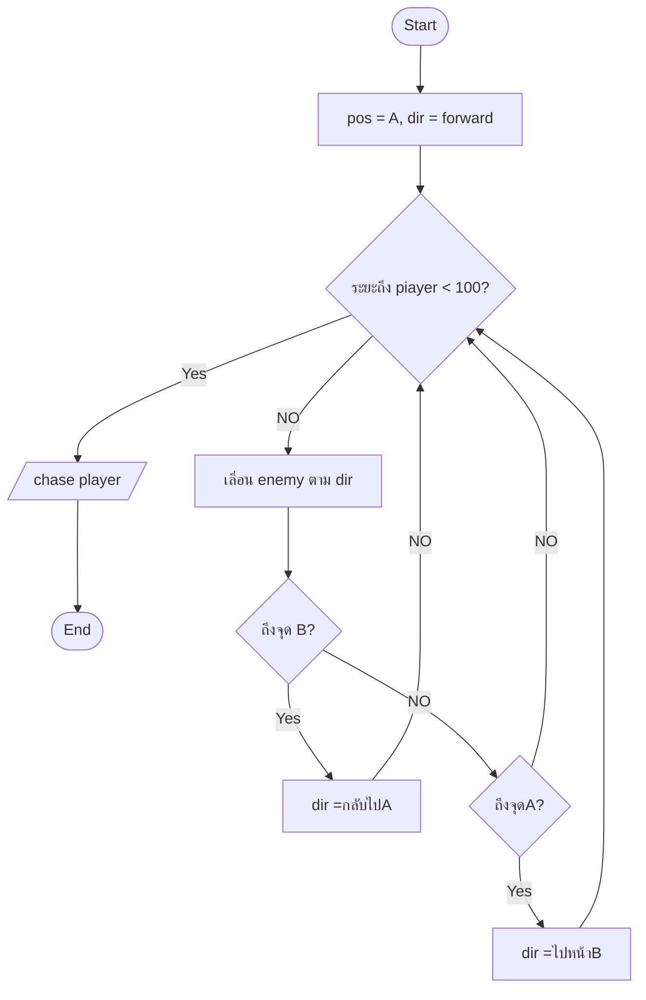

```mermaid

```

โจทย์ A — ระบบ Combat


```mermaid
flowchart TD
Start([Start]) --> Input[/รับplayer_attack, enemy_defense,
enemy_h/]
Input --> Calc["damage = max(player_attack - enemy_defense,
1)"]
Calc --> Reduce["enemy_hp = enemy_hp - damage"]
Reduce --> D1{enemy_hp <= 0?}
D1 -->|Yes| Win[/แสดง Victory!/]
D1 -->|No| Show[/แสดง enemy_hp ที่เหลือ/]
Win & Show --> End([End])
```

โจทย์ B — ระบบ Level Up




โจทย์ C (ท้าทาย) — Simple AI Patrol



